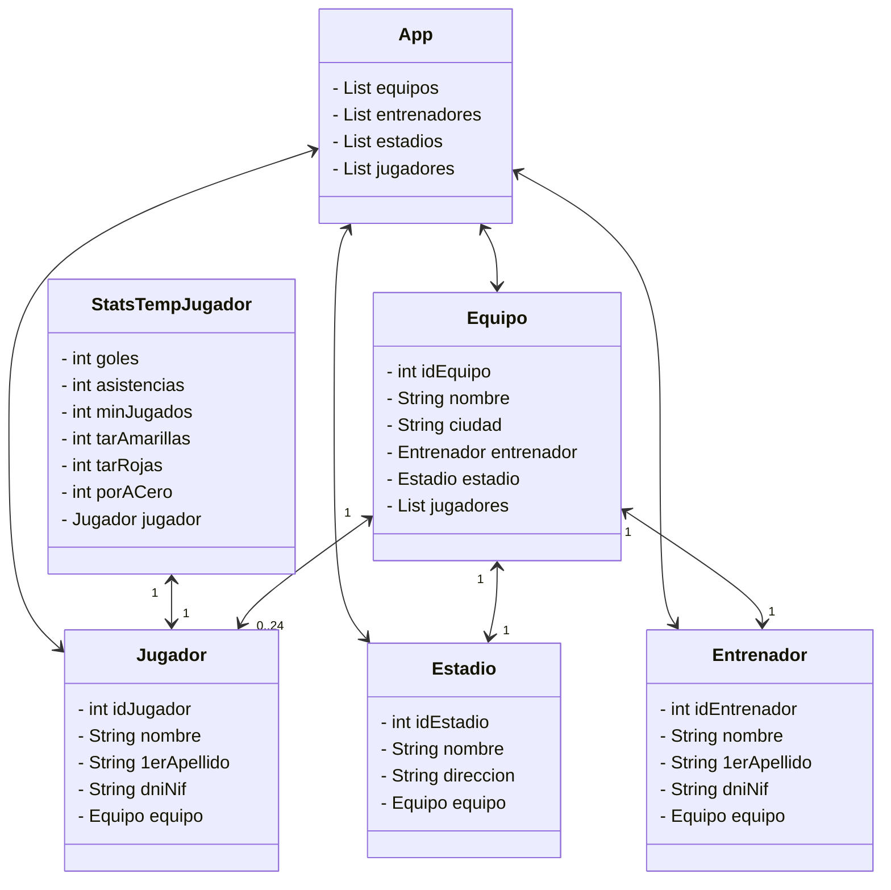

# Gipsy Champions App

## Descripción

Gipsy Champions App es una aplicación Java que simula la gestión de equipos de fútbol en la "Liga Morrocotuda". Permite gestionar equipos, entrenadores, estadios, jugadores y sus estadísticas temporales. La aplicación ofrece funcionalidades básicas como obtener equipos aleatorios, buscar equipos por ID y listar todos los equipos disponibles.

## Características

- **Gestión de Equipos**: Crear y gestionar equipos con información básica (nombre, ciudad).
- **Entrenadores**: Asignar entrenadores a equipos con datos personales.
- **Estadios**: Asociar estadios a equipos con nombre y dirección.
- **Jugadores**: Gestionar plantillas de hasta 24 jugadores por equipo.
- **Estadísticas Temporales**: Seguimiento de estadísticas de rendimiento de jugadores (goles, asistencias, minutos jugados, tarjetas, etc.).
- **Interfaz de Consola**: Menú interactivo para acceder a las funcionalidades.

## Tecnologías Utilizadas

- **Java 21**: Lenguaje de programación principal.
- **Maven**: Herramienta de gestión de dependencias y construcción.
- **JUnit 5**: Framework para pruebas unitarias.
- **Mermaid**: Para diagramas de clases.

## Estructura del Proyecto

```
gipsychampionsapp/
├── src/
│   ├── main/
│   │   └── java/
│   │       └── org/palomafp/gipsychampionsapp/
│   │           ├── App.java                    # Clase principal con el menú de consola
│   │           ├── EquipoDAO.java             # Data Access Object para gestión de equipos
│   │           └── modelo/
│   │               ├── Equipo.java            # Modelo de datos para Equipo
│   │               ├── Entrenador.java        # Modelo de datos para Entrenador
│   │               ├── Estadio.java           # Modelo de datos para Estadio
│   │               ├── Jugador.java           # Modelo de datos para Jugador
│   │               └── StatsTempJugador.java  # Modelo de datos para estadísticas temporales
│   └── test/
│       └── java/
│           └── org/palomafp/gipsychampionsapp/
│               ├── AppTest.java               # Pruebas unitarias básicas
│               └── EquipoDAOTest.java         # Pruebas unitarias para EquipoDAO
├── pom.xml                                    # Archivo de configuración Maven
└── README.md                                  # Este archivo
```

## Diagrama de Clases



## Instalación y Ejecución

### Prerrequisitos

- Java 21 o superior instalado
- Maven 3.6 o superior instalado

### Compilación

Para compilar el proyecto, ejecuta el siguiente comando en la raíz del proyecto:

```bash
mvn clean compile
```

### Ejecución

Para ejecutar la aplicación, usa el siguiente comando:

```bash
mvn exec:java -Dexec.mainClass="org.palomafp.gipsychampionsapp.App"
```

O compila y ejecuta directamente con Java:

```bash
mvn clean package
java -cp target/classes org.palomafp.gipsychampionsapp.App
```

### Menú de la Aplicación

Al ejecutar la aplicación, verás el siguiente menú:

```
LIGA MORROCOTUDA
----------------
1. Equipo Random
2. Equipo por Id
3. Todos los equipos
4. Salir
```

- **Opción 1**: Muestra un equipo aleatorio de la liga.
- **Opción 2**: Permite seleccionar un equipo específico por su ID.
- **Opción 3**: Lista todos los equipos disponibles.
- **Opción 4**: Salir de la aplicación.

## Pruebas

Para ejecutar las pruebas unitarias, usa el siguiente comando:

```bash
mvn test
```

Las pruebas incluyen:
- Verificación de que la lista de equipos no está vacía
- Pruebas de obtención de equipo aleatorio
- Pruebas de obtención de equipo por ID

## Modelos de Datos

### Equipo
Representa un equipo de fútbol con:
- ID único
- Nombre del equipo
- Ciudad de origen
- Entrenador asignado
- Estadio local
- Lista de jugadores (máximo 24)

### Entrenador
Contiene información del entrenador:
- ID único
- Nombre y primer apellido
- DNI/NIF
- Equipo al que pertenece

### Estadio
Información del estadio:
- ID único
- Nombre del estadio
- Dirección
- Equipo propietario

### Jugador
Datos de los jugadores:
- ID único
- Nombre y primer apellido
- DNI/NIF
- Equipo al que pertenece

### StatsTempJugador
Estadísticas temporales de rendimiento:
- Goles marcados
- Asistencias
- Minutos jugados
- Tarjetas amarillas
- Tarjetas rojas
- Partidos a cero (porteros)

## EquipoDAO

La clase `EquipoDAO` actúa como Data Access Object y contiene datos de ejemplo para 4 equipos ficticios de la "Liga Morrocotuda":
- Real Vardrid (Madrid)
- Varcelona (Barcelona)
- Patético de Madrid (Madrid)
- Los Morrocotudos (Distrito San Blas-Canillejas-Ciudad Lineal)

Cada equipo incluye entrenador, estadio y algunos jugadores de ejemplo.

## Contribución

Para contribuir al proyecto:
1. Haz un fork del repositorio
2. Crea una rama para tu feature (`git checkout -b feature/nueva-funcionalidad`)
3. Commit tus cambios (`git commit -am 'Añade nueva funcionalidad'`)
4. Push a la rama (`git push origin feature/nueva-funcionalidad`)
5. Abre un Pull Request

## Licencia

Este proyecto está bajo la Licencia MIT. Ver el archivo LICENSE para más detalles.

## Autor

Proyecto desarrollado por [Tu Nombre] - palomafp