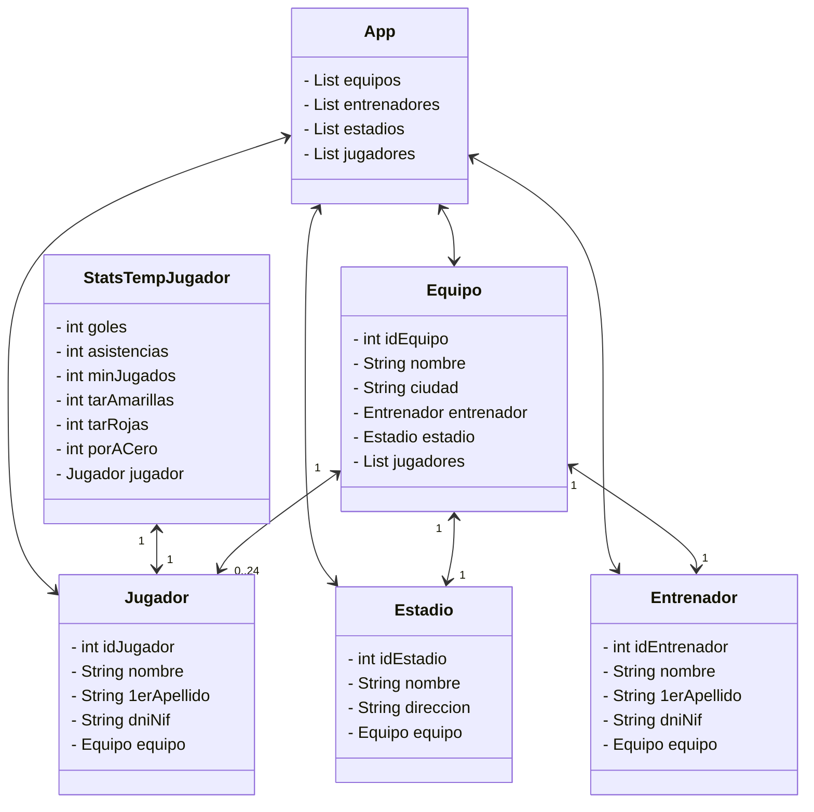

```mermaid
classDiagram

Equipo "1" <--> "0..24" Jugador
Equipo "1" <--> "1" Estadio
Equipo "1" <--> "1" Entrenador
StatsTempJugador "1" <--> "1" Jugador
App <--> Equipo
App <--> Entrenador
App <--> Estadio
App <--> Jugador

class Equipo{
    - int idEquipo
    - String nombre
    - String ciudad
    - Entrenador entrenador
    - Estadio estadio
    - List<Jugador> jugadores
}

class Entrenador{
    - int idEntrenador
    - String nombre
    - String 1erApellido
    - String dniNif
    - Equipo equipo
}

class Estadio{
    - int idEstadio
    - String nombre
    - String direccion
    - Equipo equipo
}

class Jugador{
    - int idJugador
    - String nombre
    - String 1erApellido
    - String dniNif
    - Equipo equipo
}

class StatsTempJugador{
    - int goles
    - int asistencias
    - int minJugados
    - int tarAmarillas
    - int tarRojas
    - int porACero
    - Jugador jugador
}

class App{
    - List<Equipo> equipos
    - List<Entrenador> entrenadores
    - List<Estadio> estadios
    - List<Jugador> jugadores
}

```